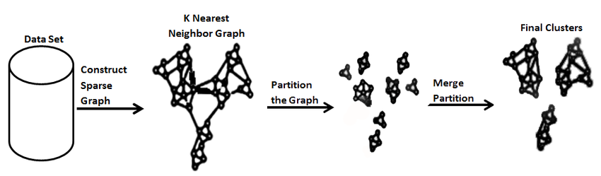
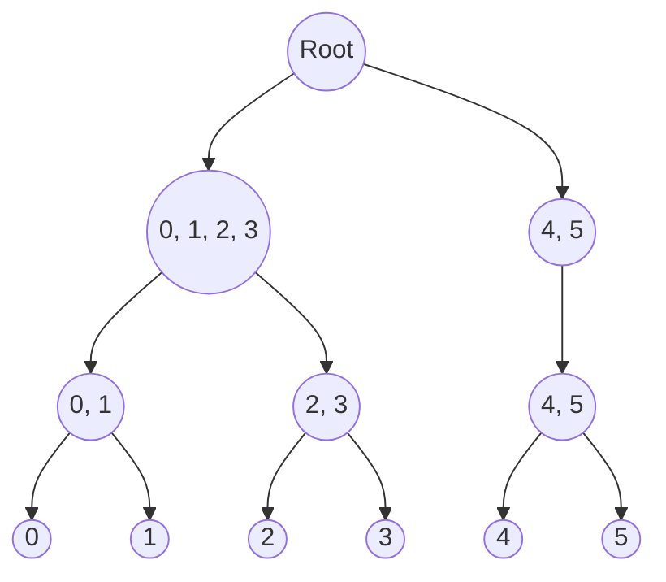
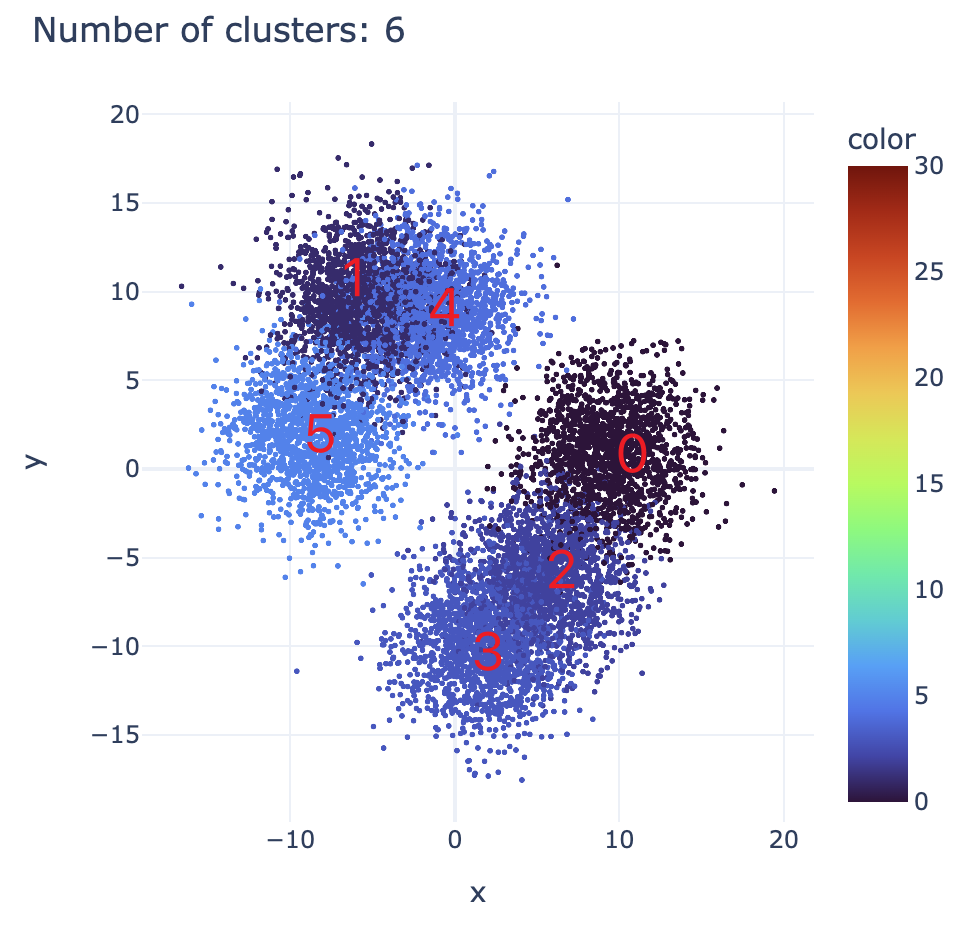
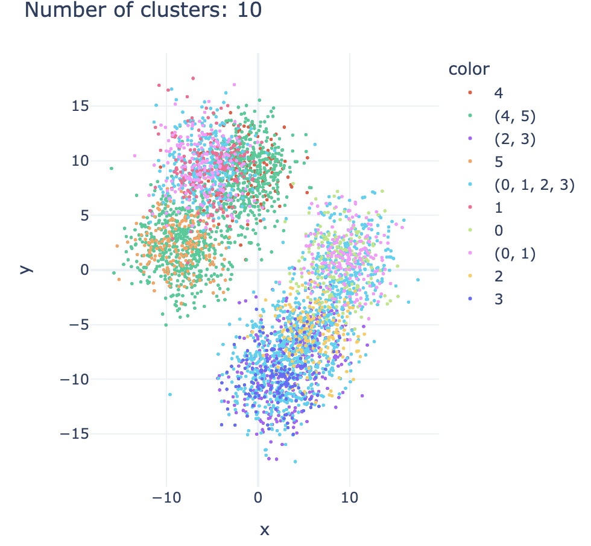
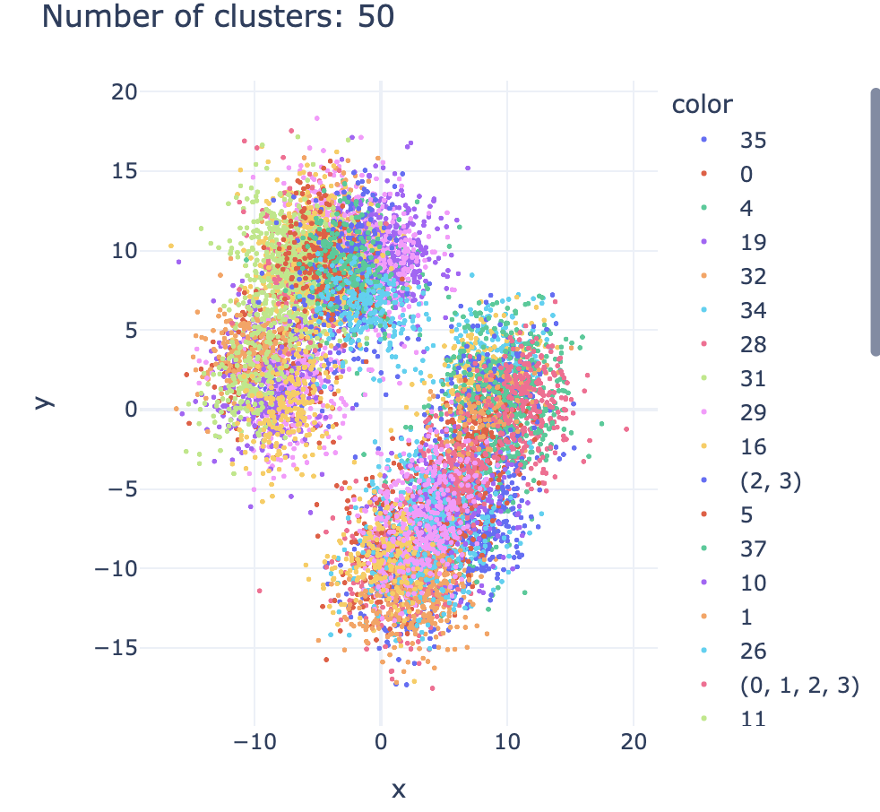
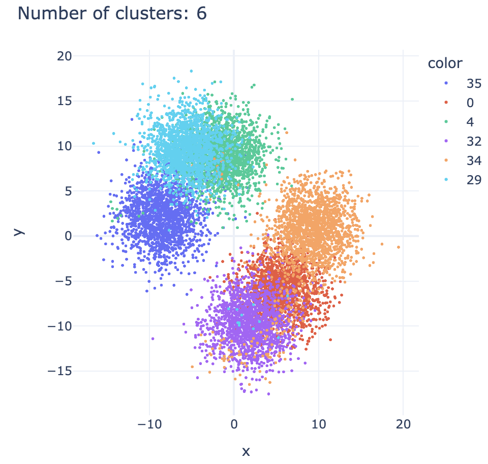

# Semi-supervised Chameleon Clustering

An implementation of semi-supervised Chameleon clustering, capable of integrating must-link and cannot-link constraints at various levels of hierarchy to guide the clustering process. It also offers the ability to perform Chameleon clustering without any constraints, i.e., pure unsupervised clustering. 

Original Chameleon clustering is detailed in [Chameleon: hierarchical clustering using dynamic modeling](https://ieeexplore.ieee.org/document/781637). The addition of semi-supervised elements, incorporating known constraints, is inspired by [Semi-supervised Hierarchical Clustering Ensemble and Its Application](https://www.researchgate.net/publication/283003965_Semi-supervised_Hierarchical_Clustering_Ensemble_and_Its_Application). My implementation has been optimized for speed, structure, and readability, and updated for recent versions of networkx and metis, taking reference from [Moonpuck's Chameleon Clustering](https://github.com/Moonpuck/chameleon_cluster).

## Introduction

### 1. Chameleon Clustering

Chameleon is a type of hierarchical clustering that works in two steps: first, it breaks down the data into many small groups using graph partitioning; then, it brings these groups back together in a way that better reflects the natural groupings in the data.

*Visualization of Chameleon Clustering (Image by Muhammad Ilyas)*

Chameleon's advantages over conventional hierarchical clustering include:

1. It evaluates both relative interconnectivity and closeness of potential cluster merges, ensuring the resultant clusters are both internally cohesive and distinctly separated from other clusters.
2. It provides hyperparameter to fine-tune the balance between interconnectivity and closeness, providing flexibility for various application domains.

### 2. Semi-supervised Clustering

Semi-supervised clustering uses extra information (constraints) to guide the grouping process. This is helpful when the data is too complex or large to explore without guidance. Sometimes we have some knowledge about the data, like some labels or relationships, but not enough to fully supervise the learning process.

Types of constraints we handle:

- Must-link and cannot-link: specific points that should or should not be grouped together.
- Must-link before: specific points that should be grouped together early in the clustering process. For example, when some labels are partially known.

My implementation focuses on these constraints and allows for more accurate and efficient grouping of data, especially when some higher-level information is already known. This makes the clustering process more informed and tailored to the actual structure and known characteristics of the data.

## Breakdown of Process

In this section, we distill the procedure of semi-supervised chameleon clustering.

### 1. Graph Construction from Data

The initial step involves creating a graph from data, where the weights of the edges represent the similarity between instances. This graph illustrates the relationship of proximity between instances, with a higher similarity resulting in a greater edge weight. Consequently, nodes with strong similarity are less likely to be split in the partition phase.

To create a similarity graph, there are several methods. For purely numeric data, the k-nearest neighbors method using Euclidean distance is common. For mixed-type data, the heterogeneous Euclidean-overlap metric (HEOM) is applicable. HEOM involves calculating and normalizing pairwise distances for each feature, then summing these to form a final distance matrix. Additionally, ensemble clustering can be employed to derive a similarity graph from multiple clustering algorithms. By transforming the cluster labels into a binary indicator matrix and concatenating these for each algorithm, a comprehensive matrix, $H$, is formed. The similarity matrix is then defined as $S=\frac{1}{r}HH^T$, where $r$ represents the number of clustering algorithms. All these methods are implemented in this repository for creating similarity graphs.

### 2. Pre-label according to Known Clusters (Semi-supervised)

This is where the "supervision" in "semi-supervised" comes in. This pre-labeling is reflected in the node attribute "cluster." Such pre-labeled nodes are treated differently in the partition phase. Specifically, nodes with the finest level of classification (without ambiguity) are excluded from further partitioning; they won't be divided into smaller sub-clusters. Conversely, nodes classified at a broader level will still participate in the partition phase.

### 3. Partition Phase

During the partition phase, subgraphs comprising nodes from the same cluster are iteratively divided into smaller sub-clusters. The partition algorithm employed is [METIS](http://glaros.dtc.umn.edu/gkhome/metis/metis/overview), a graph partitioning algorithm spliting a cluster into two roughly parts so that the edges cut are minimized. The final number of clusters is a hyperparameter. Opting for more clusters improves accuracy but also increase computation costs in the subsequent merge phase.

### 4. Merge Phase

The merge phase involves iteratively combining the two closest clusters until the desired number of clusters is achieved. To determine the similarity between clusters, metrics of relative interconnectivity and relative closeness are used.

#### Interconnectivity

$RI(C_i, C_j) = \frac{2 |sum(EC(C_i, C_j))|}{|sum(EC(C_i))|+|sum(EC(C_j))|}$

  - $RI(C_i, C_j)$ is the relative interconnectivity between cluster $C_i$ and $C_j$.
  - $|sum(EC(C_i, C_j))|$ is the **absolute interconnectivity** between cluster $C_i$ and $C_j$, which equals the sum of the weight of the edges that straddle the two clusters.
  - $|sum(EC(C_i))|$ is the **internal interconnectivity**, defined by the sum of edges crossing a min-cut bisection that splits the cluster into two roughly equal parts.

Interconnectivity is trying to capture the degree to which two clusters are functionally connected. A high interconnectivity relative to the internal connectivity of the clusters indicates a strong relationship between the clusters, suggesting they might naturally belong together. It ensures that the algorithm does not merge clusters that are only incidentally close but are not actually related. 

By looking at how interconnected two clusters are, we tries to ensure that any merged clusters have a genuine, meaningful connection.

#### Closeness

$RC(C_i, C_j) = \frac{mean(EC(C_i, C_j))}{\frac{|C_i|}{|C_i|+|C_j|}mean(EC(C_i))|+\frac{|C_j|}{|C_i|+|C_j|}mean(EC(C_j))}$

- $mean(EC(C_i, C_j))$ is the **absolute closeness** between cluster $C_i$ and $C_j$, which equals the average of the weight of the edges that straddle the two clusters.
- $mean(EC(C_i))$ is the **internal interconnectivity**, defined by the mean of edges crossing a min-cut bisection that splits the cluster into two roughly equal parts.

Closeness is trying to capture the proximity or density between clusters. A high relative closeness means that not only are the clusters close to each other, but this closeness is significant compared to their internal density or spread. This suggests that merging the clusters would not lead to a significant loss of internal coherence.

It ensures that the clusters being merged are actually close to each other in the data space, maintaining the integrity and compactness of the resulting cluster.

#### Similarity

Based on interconnectivity and closeness, there exist two approach two calculate similarity:

- Approach 1: Two clusters are "similar" when there relative interconnectivity and closeness are both larger than a threshold. If more than one adjacent clusters meet the criterion, then the nearest one is chosen.

- Approach 2: $Similarity(C_i, C_j) = RI(C_i, C_j) \times RC(C_i, C_j)^{\alpha}$
	- higher α means higher importance of relative closeness compared to relative interconnectivity

#### Cannot-link constraints

Semi-supervised constraints influence this phase as well. Similar to the pre-label section, when we have partially known classifications for certain instances, we can obtain a cannot-link matrix based on this. This matrix dictates that if two clusters contain instances that should not be grouped together (cannot-link), their similarity is overridden to zero, regardless of their interconnectivity or closeness. This ensures that such clusters are not merged, adhering to the known classifications and maintaining the integrity of the clustering process.

### 5. Remapping Clusters to Classes

Following the merge phase, the process yields the target number of clusters, each ideally corresponding to a hierarchical class. The critical outcome is that each cluster should exclusively contain instances associated with a single known label, which is then designated as the classification for that entire cluster. This step ensures that the clusters are meaningfully mapped to distinct classes, reflecting the hierarchical structure of the data and the labels.

## Results

In this section, we present results from applying the semi-supervised Chameleon clustering algorithm to synthetic data, designed to mimic a complex hierarchy with three levels:

For our experiment, we simulate partial knowledge about the dataset by revealing the labels of some points at different levels of the hierarchy: 20% of the instances are known at the first level, 10% at the second level, and another 10% at the third (most specific) level.

#### 1. Initial Cluster Assignments for Synthetic Data
Here's how the synthetic data is initially divided into clusters:
 

#### 2. Clusters from Partially Labeled Points
This image shows clustering considering the partially labeled points, integrating some known structure:
 

#### 3. Partition Phase
Post the partition phase, the data is divided into numerous smaller subclusters, preparing for the merging process:
 

#### 4. Merge Phase
Finally, during the merge phase, subclusters are combined based on their relative interconnectivity and closeness, considering the semi-supervised constraints:
 

By incorporating the semi-supervised constraints, the algorithm achieved an accuracy of 96.87% in clustering the synthetic data, which is an improvement of 2.79% over the purely unsupervised case. In addition, the semi-supervised approach was faster because some clusters are assigned in advance based on prior knowledge, saving time in the partition phase.