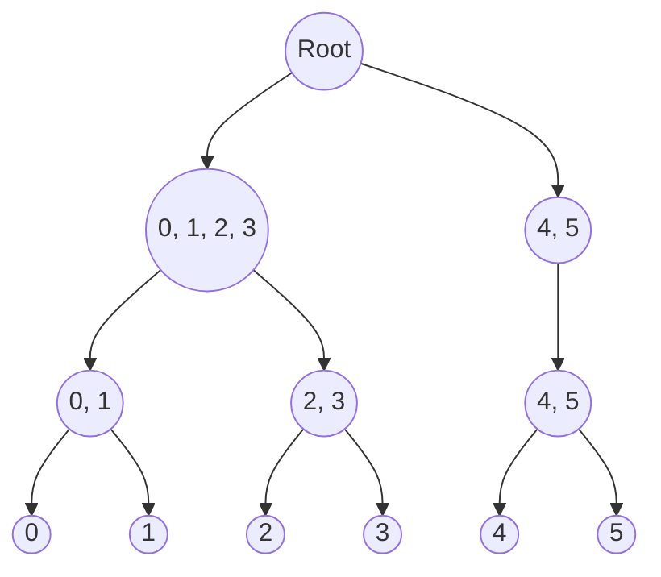

# Semi-supervised Chameleon Clustering

An implementation of semi-supervised Chameleon clustering, capable of integrating must-link and cannot-link constraints at various levels of hierarchy to guide the clustering process. It also offers the ability to perform Chameleon clustering without any constraints, i.e., pure unsupervised clustering. 

Original Chameleon clustering is detailed in [Chameleon: hierarchical clustering using dynamic modeling](https://ieeexplore.ieee.org/document/781637). The addition of semi-supervised elements, incorporating known constraints, is inspired by [Semi-supervised Hierarchical Clustering Ensemble and Its Application](https://www.researchgate.net/publication/283003965_Semi-supervised_Hierarchical_Clustering_Ensemble_and_Its_Application). My implementation has been optimized for speed, structure, and readability, and updated for recent versions of networkx and metis, taking reference from [Moonpuck's Chameleon Clustering](https://github.com/Moonpuck/chameleon_cluster).

## Introduction

### 1. Chameleon Clustering

Chameleon is a type of hierarchical clustering that works in two steps: first, it breaks down the data into many small groups using graph partitioning; then, it brings these groups back together in a way that better reflects the natural groupings in the data.

*Visualization of Chameleon Clustering (Image by Muhammad Ilyas)*

Chameleon's advantages over conventional hierarchical clustering include:

1. It evaluates both relative interconnectivity and closeness of potential cluster merges, ensuring the resultant clusters are both internally cohesive and distinctly separated from other clusters.
2. It provides hyperparameter to fine-tune the balance between interconnectivity and closeness, providing flexibility for various application domains.

### 2. Semi-supervised Clustering

Semi-supervised clustering uses extra information (constraints) to guide the grouping process. This is helpful when the data is too complex or large to explore without guidance. Sometimes we have some knowledge about the data, like some labels or relationships, but not enough to fully supervise the learning process.

Types of constraints we handle:

- Must-link and cannot-link: specific points that should or should not be grouped together.
- Must-link before: specific points that should be grouped together early in the clustering process. For example, when some labels are partially known.

My implementation focuses on these constraints and allows for more accurate and efficient grouping of data, especially when some higher-level information is already known. This makes the clustering process more informed and tailored to the actual structure and known characteristics of the data.

## Results

In this section, we present results from applying the semi-supervised Chameleon clustering algorithm to synthetic data, designed to mimic a complex hierarchy with three levels:

For our experiment, we simulate partial knowledge about the dataset by revealing the labels of some points at different levels of the hierarchy: 20% of the instances are known at the first level, 10% at the second level, and another 10% at the third (most specific) level.

#### 1. Initial Cluster Assignments for Synthetic Data
Here's how the synthetic data is initially divided into clusters:

#### 2. Clusters from Partially Labeled Points
This image shows clustering considering the partially labeled points, integrating some known structure:

#### 3. Partition Phase
Post the partition phase, the data is divided into numerous smaller subclusters, preparing for the merging process:

#### 4. Merge Phase
Finally, during the merge phase, subclusters are combined based on their relative interconnectivity and closeness, considering the semi-supervised constraints:

By incorporating the semi-supervised constraints, the algorithm achieved an accuracy of 96.87% in clustering the synthetic data, which is an improvement of 2.79% over the purely unsupervised case. In addition, the semi-supervised approach was faster because some clusters are assigned in advance based on prior knowledge, saving time in the partition phase.